+++
title = 'まよろばの世界を観光してきた'
date = 2025-08-23T17:28:09+09:00
categories = ["ゲーム感想"]
description = "迷宮郷まよろばのプレイ感想"
draft = false
tags = ["感想", "ゲーム"]
+++

# 「迷宮郷まよろば」やりました

[配布ページ](https://freegame-mugen.jp/adventure/game_13282.html)

ドット絵に惹かれてプレイしたのですが、なんと「BGMもグラフィックもすべて自分で描いた」という化け物具合...

# どんなゲーム？

一応探索ゲーとなっていますが、個人的には「観光ゲー」と言った方がしっくり来ます。

プレイ時間は2時間ほどで、ゲームの流れとしては

- 宝探し
- タスク

この二つを完了することでゴールとなり、ゲームクリアとなります。しかし二つ目に関しては、宝探しをしていれば9割は自然に埋まるので、実質宝探しのみです。

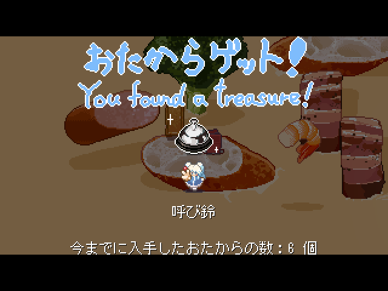

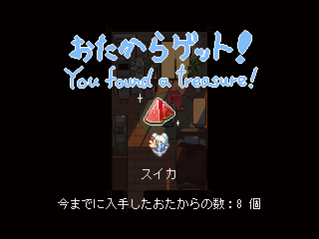

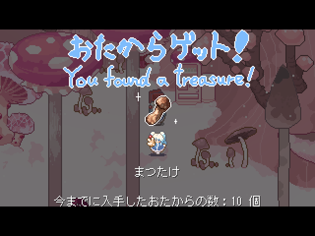
このキノコ探すの少し大変でした...

観光するにあたって地図があるので、それを穴があくほど見ましょう

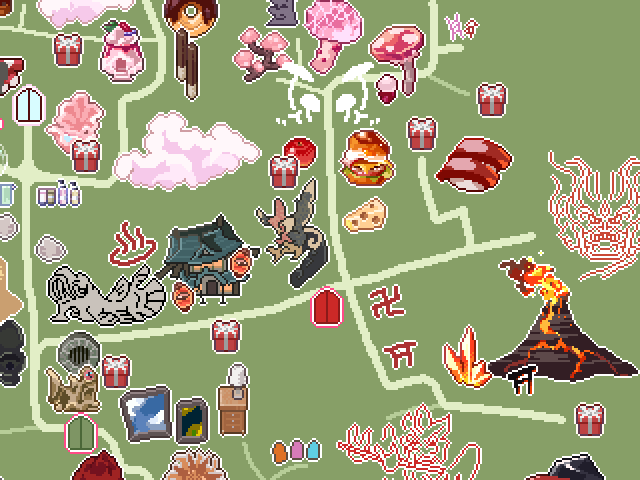

# ドット絵が綺麗
僕がひかれた点でもありますが、まず何と言っても「ドット絵がすごく綺麗」です！

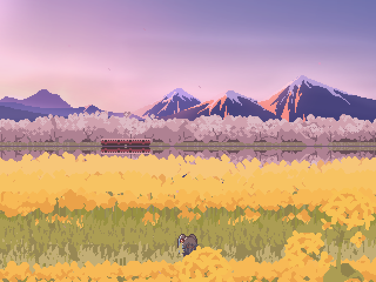
こういう自然豊かな風景好き

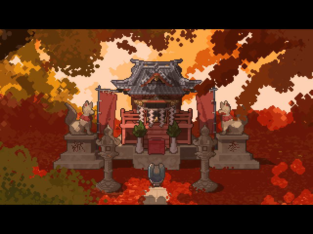
それっぽい祠も好き

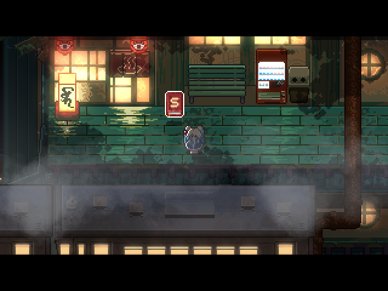
旅館ですか？　好きですよ、ええ

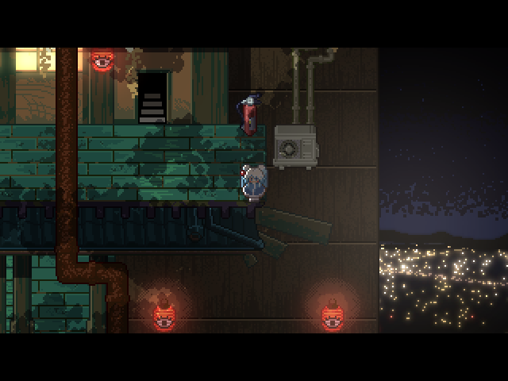
上から街を見下ろす夜景も良いです

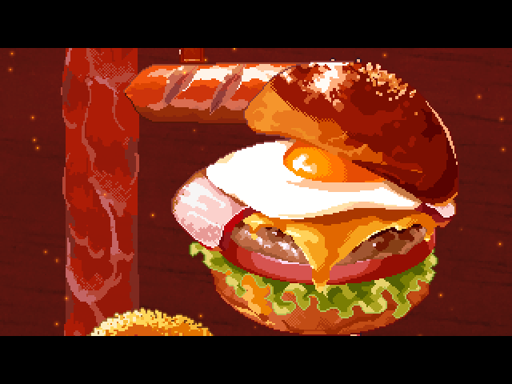
美味しそう

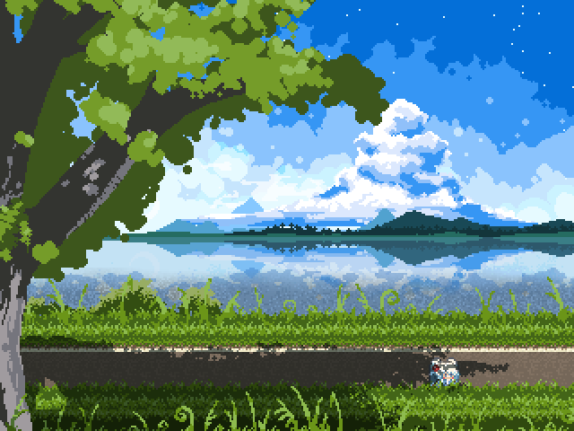

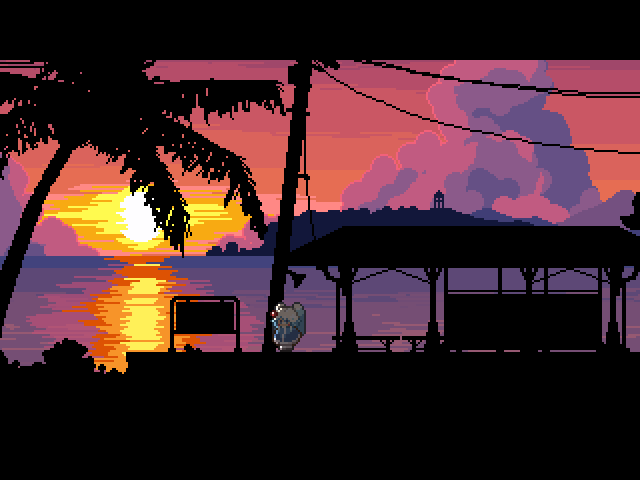
水の表現が綺麗です

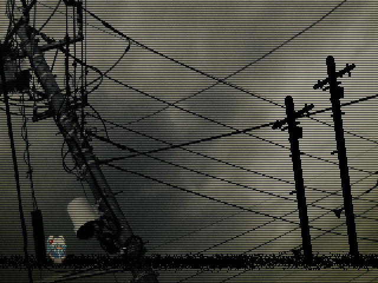
こういったちょっとホラーな感じも

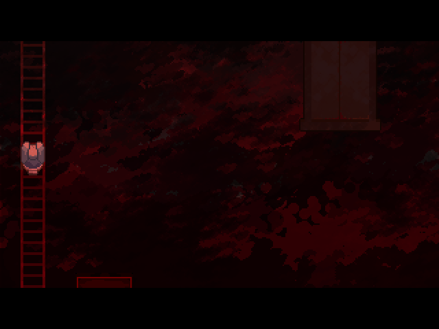

こんな感じに、様々な雰囲気のドット絵を味わうことができます。ですからこのゲームは「観光ゲー」なのです。

特に自分のようなドット絵の風景画が好きな人におすすめです。ゲームオーバーがないのでまったり堪能することができます。

# 個人的に難しかった点
一番は「隠された子供部屋」です。さきほどは「宝探しをしていればタスクは9割埋まる」と言いましたが、埋まらない要因がこれです。ゲーム内にヒントもありません。

マップ自体が位置関係を把握することが複雑なのもあり、30分くらいここで走り回っていました。しかし、よく見たら「あれじゃね？」というのをようやく見つかりました。

いやー、完全に盲点でしたね。

# 総括
ドット絵を描いている身として大変参考になりました。こういう感じのゲームを作ってみるのもアリだなーと思ったので、これから色々考えてみようと思います。

使用したゲームエンジンはウディタ(WOLF RPGエディター)というものらしく、こちらも後で調べようと思います。